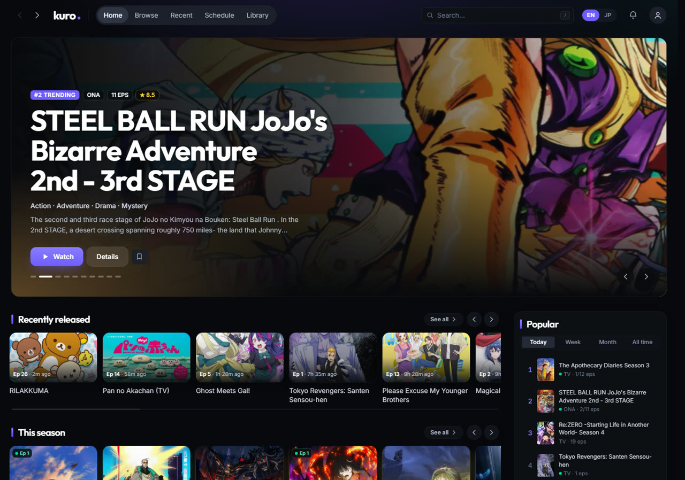
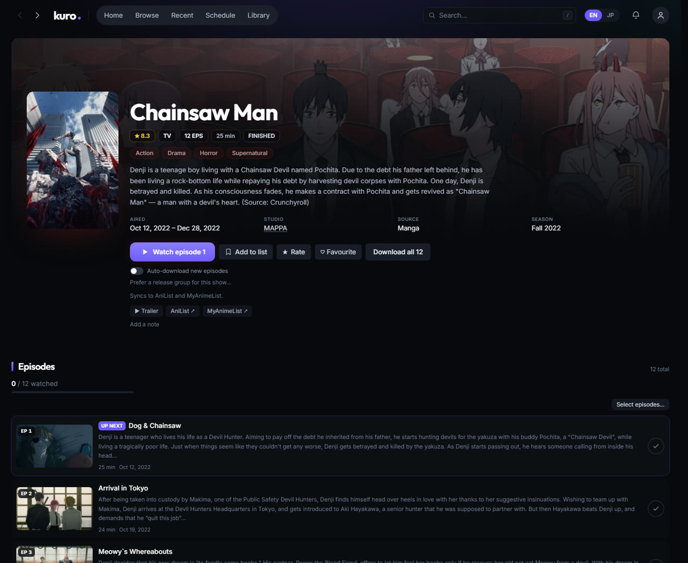
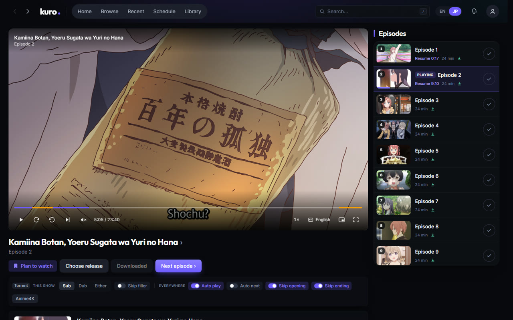

# kuro — self-hosted anime streaming

[](https://github.com/Tons-7/kuro/releases/latest)
[](LICENSE.md)
[](go.mod)

Search any anime, press play, and it streams from a torrent while it downloads,
with no waiting for a complete file. Progress syncs to AniList and MyAnimeList
as you watch.

Everything runs on your own machine: one binary with a built-in torrent engine,
a browser player and one config file.



## What it does

- **Streams while downloading.** Seeking into a part not yet downloaded works;
  the rest is fetched in the background so the next episode is already there.
- **Built-in torrent engine.** Picks the best release (resolution, codec, group,
  seeders, SeaDex), handles season packs, and needs nothing else installed.
- **Plays anywhere.** In the browser by default, so a phone or TV on the same
  network works the same as the laptop. mpv and VLC are available as external
  players, with Anime4K upscaling.
- **Sub or dub**, chosen per show, with subtitle delay and size controls.
- **Knows 34,000+ anime**, including the ~11,700 that exist on MyAnimeList but
  not AniList.
- **Marks filler and recap episodes**, so a rewatch can skip them.
- **Skips openings and endings**, if you ask it to. Nothing is automatic by
  default.
- **Follows airing shows:** notifies you of new episodes and can download them.
- **Plays files you already have.** Point it at a folder and matched episodes
  play instantly with no torrent involved.
- **Tracks progress** on AniList and MyAnimeList, in both directions.

| Series page | Player |
| --- | --- |
|  |  |

## Download

Get `kuro-<version>.zip` from the [latest release](https://github.com/Tons-7/kuro/releases/latest),
extract it to a folder of its own and run `kuro.exe`. The first-run screen
downloads ffmpeg (or uses one already on your `PATH`) and shows how to add the
torrent sites to search. Updates are offered in the app.

## Building from source

Three things are needed before the first run: the external tools, the torrent
sites to search, and an AniList application so it can talk to your list.

```powershell
# Fetch ffmpeg, mpv and the Anime4K shaders into bin/
./scripts/fetch-deps.ps1

# Build the frontend and the binary that embeds it
./scripts/build.ps1

./kuro.exe
```

Then open <http://localhost:4321>.

On **macOS and Linux** build with `scripts/build.sh` and run `./kuro`. The
first-run screen downloads what it can (ffmpeg on Linux) into `bin/`;
what has no clean prebuilt binary — ffmpeg on macOS, and mpv everywhere but
Windows — is a package-manager install kuro then finds on `PATH`
(`brew install ffmpeg mpv`, `apt install ffmpeg mpv`). mpv is only the optional
desktop player; the browser player needs just ffmpeg.

The torrent engine is built in. It takes peers on port 4240 (TCP and UDP;
`[torrent] listen_port` changes it) and asks the router to forward it over
UPnP. Downloads from an older kuro that used rqbit carry over on first run.

`config.toml` is written beside the binary on first run. kuro ships with no
torrent sites; add one block per site and restart. `type` is the feed format
the site serves, `nyaa` or `tokyotosho`; `adult = true` marks a site searched
only for titles the catalogue marks adult. The first site listed decides the
record kept for a torrent several carry.

```toml
[[indexer]]
type = "nyaa"
url  = "https://…"

[[indexer]]
type = "tokyotosho"
url  = "https://…"
```

To connect AniList,
register an application at <https://anilist.co/settings/developer> with the
redirect URL `http://localhost:4321/callback` and paste the client id and
secret in. MyAnimeList is optional and works the same way, at
<https://myanimelist.net/apiconfig> with `http://localhost:4321/mal/callback`.

`/api/setup` reports which components are installed and what each is for.

### Updating

A packaged build checks GitHub releases on launch and every few hours, and
offers a newer version under **Settings → About**. Only `kuro.exe` is
replaced; `bin/`, the cache, `config.toml` and the database stay. Builds from
`build.ps1` without `-Version` are `dev` and never update themselves.

To publish a release: `./scripts/package.ps1 -Version 2026.08.27 -Publish`
(needs `gh auth login` once). It attaches both zips and `SHA256SUMS.txt`,
which the updater verifies before touching anything.

### Everything in one folder

Watch history, settings and logins live in `%LOCALAPPDATA%\kuro` by default,
where a synced or moved folder cannot corrupt them. To keep kuro self-contained
— a folder you can extract anywhere and run — pick a folder under **Setup →
Where things go** (or set `data_dir` in `config.toml`). kuro copies the
database there and uses it from the next start.

Every folder kuro writes to is a `config.toml` setting; relative paths are
beside the binary, and a restart applies them:

```toml
data_dir = "data"        # database and window profile
cache_dir = "cache"      # downloaded episodes, transcodes, thumbnails, updates
bin_dir = "bin"          # ffmpeg, mpv, shaders
```

VLC is found on PATH or in Program Files. An install anywhere else — another
drive, a portable copy — is named with `vlc_path`, its folder or its binary:

```toml
vlc_path = 'E:\VideoLAN\VLC'
```

### Watching on a phone or TV

Turn on **Settings → Access → Allow other devices**; no restart needed.
Anything off this machine then needs a token, so the same page shows a QR code
to scan. Loopback stays open, so watching on the machine itself needs nothing.

**Ask before letting a device in.** On the same page, a device with the link can
also be made to wait until you accept it on this machine: *Once* remembers it,
*Every time* asks again after 30 minutes away or a restart. Requests pop up on
whatever kuro page is open here, and the list of devices is in Settings.

### Installing as an app on a phone

Android only installs a site as an app (its own window, no address bar) over
HTTPS, so kuro needs a name and a certificate the phone trusts. kuro gets both
itself from a free [DuckDNS](https://www.duckdns.org) name; nothing is installed
on the phone:

1. Sign in at duckdns.org, add a name (say `mykuro`) and copy the token.
2. In **Settings → Access → Install as an app on a phone**, paste the name and
   the token.

A minute or two later the QR code leads to `https://mykuro.duckdns.org:4321`.
Open it on the phone and choose **Install app** (Brave, Chrome) or **Add to Home
Screen** (Safari). kuro points the name at this machine's home address, fetches
a Let's Encrypt certificate and renews it. `http://localhost:4321` keeps working
on this machine, on the same port.

The name points at a private address, so this works on the home network only,
and a few routers refuse such names ("DNS rebinding protection").

To use a certificate of your own instead (your domain, or `tailscale cert`),
point `config.toml` at the files; kuro rereads them when they are renewed:

```toml
tls_cert = 'kuro.example.com.crt'
tls_key = 'kuro.example.com.key'
```

## Legal

kuro is a media player and BitTorrent client. It hosts no content and ships
with none. What you search for, download and share is your responsibility;
make sure it is legal where you live. BitTorrent uploads while it downloads.

## License

[PolyForm Noncommercial 1.0.0](LICENSE.md): use, study and change kuro freely for
personal, hobby, research or non-profit purposes. Commercial use of any kind,
including selling it or a modified version, is not permitted.

## Layout

```
cmd/kuro          entrypoint and wiring
internal/
  anilist         AniList GraphQL: search, browse, schedule, list sync
  mal             MyAnimeList API v2, OAuth with PKCE
  corpus          the title database, from manami and animeApi
  match           filename to anime matching
  parse           release name parsing
  score           release ranking
  indexer         torrent search
  engine          the torrent engine (anacrolix/torrent) behind a loopback API
  torrent         client for that API: add, select, stream
  transcode       ffmpeg, HLS, subtitle and font extraction
  player          mpv over JSON IPC, Anime4K shader chains
  library         the domain: playback, sync, scanning, notifications
  store           every SQL statement
  db              connection setup and migrations
  server          HTTP handlers
  jobs            recurring background work
web               the single-page app, embedded into the binary
scripts           dependency fetch and build
```

Handlers contain no SQL and no external calls; `store` owns every statement;
`library` owns the decisions. The frontend is compiled into `web/dist` and
embedded by `web/embed.go`, which is why the build script does the frontend
first.

## Development

```powershell
go test ./...                    # the whole suite
./scripts/build.ps1 -SkipWeb     # rebuild the binary only
./scripts/build.ps1 -Target linux/amd64
```

```powershell
cd web
npm run dev                      # hot reload, proxying /api to :4321
npm run typecheck                # tsgo
npm run lint
npm run verify                   # loads every screen in a real browser
```

The dev server proxies `/api` to a running `kuro.exe`, so start the binary
first and edit the frontend against it. `npm run verify` needs the binary
running too; it reports console errors, failed requests and blank screens, and
writes a screenshot of each page.

Type checking uses `tsgo`, the native TypeScript compiler, rather than `tsc`.
